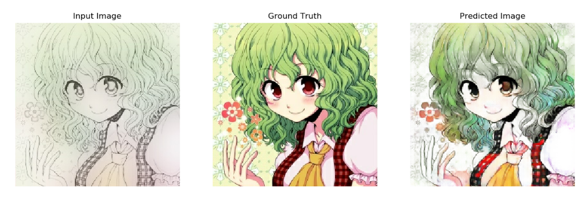
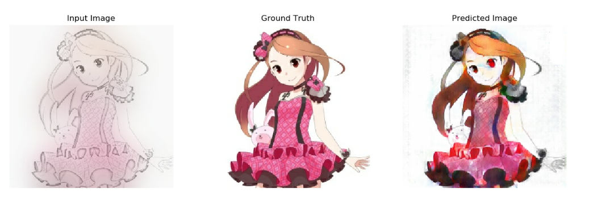
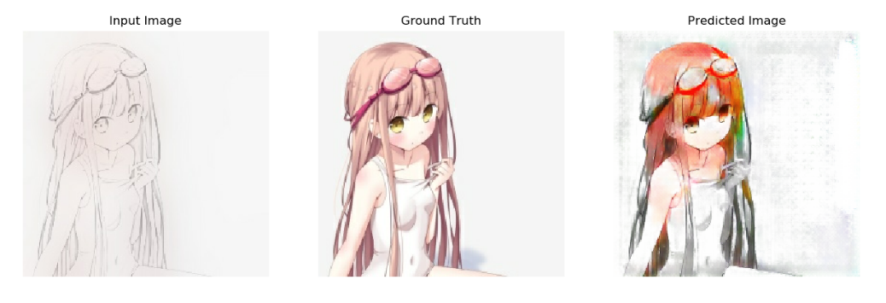

# tf_comic_color

## 代码参考自tensorflow
link: <https://www.tensorflow.org/tutorials/generative/pix2pix>

## 方法参考
link: <http://kvfrans.com/coloring-and-shading-line-art-automatically-through-conditional-gans/>

## 效果展示

## 思路
1.  将图片转成线稿图
2.  将图片进行高斯模糊化作为颜色提示
3.  两者进行结合作为训练数据

## 运行步骤
* 运行create_date创建数据
* 运行train_model训练
* 使用test_model查看训练效果
